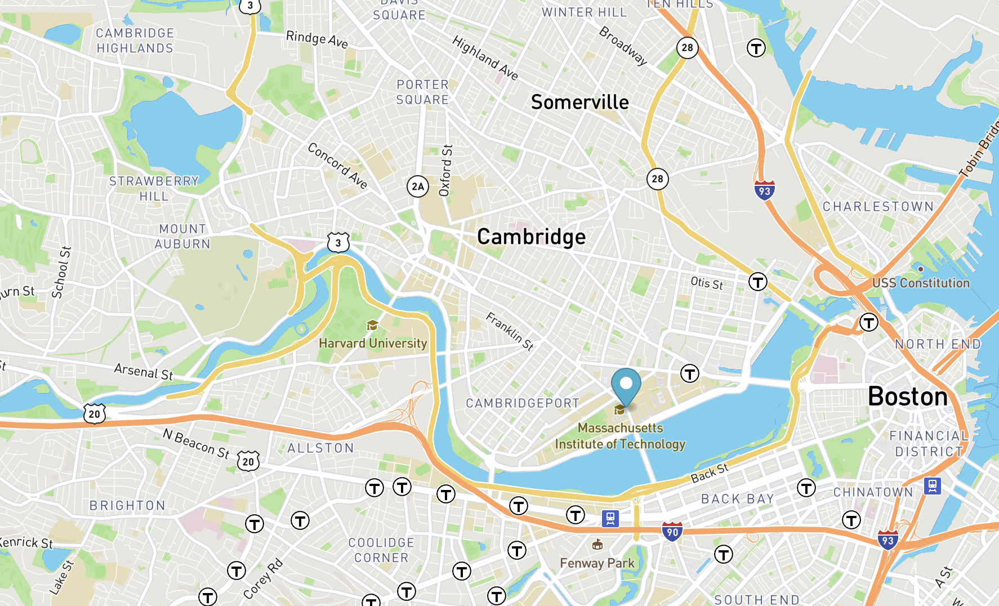

# Real-Time-Bus-Tracker
Using the free API Mapbox, a map of Boston appears with a marker that moves along the bus stations that go from MIT to Harvard. In order to make the marker move, a button to initiate the action is also included at the top of the page, called "Show stops between MIT and Harvard".
This repository includes 3 files:
1. index.html is where the javascript code and styles code of Mapbox are called. It also calls the mapanimation.js file
2. mapanimation.js this file has the formulas that allow the marker in the map to move throughout the bus stations
3. styles.css this file has the styles of the html file

Roadmap of improvements:
1. Include a button to make the bus marker stop at any time
2. Change the style of the map
3. Add a box showing the name of the stop the bus is passing by

< img src="bostonmap.png" />

